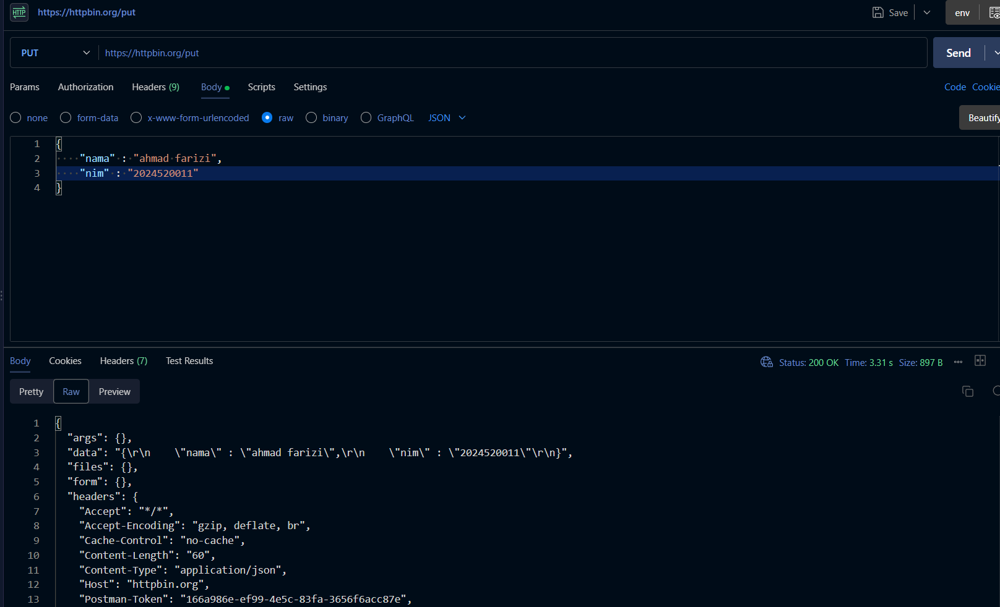
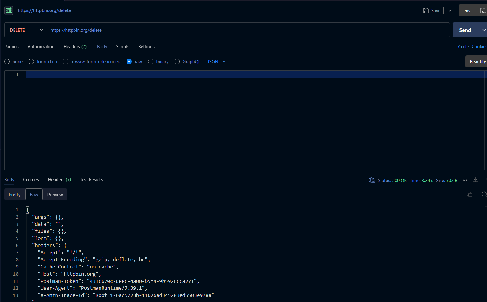

# Tugas Mandiri 1 — Mengenal HTTP Method dan Endpoint

**Nama:** Ahmad Farizi
**NIM:** 2024520011
**Tools:** Postman
**Base URL:**
```text
https://httpbin.org
```

## A. Tujuan

Tugas ini bertujuan untuk memahami hubungan antara HTTP method, endpoint, parameter, request, dan response dengan melakukan pengujian terhadap beberapa endpoint HTTPBin menggunakan Postman.

Endpoint yang diuji meliputi:

- GET `/get`
- POST `/post`
- PUT `/put`
- PATCH `/patch`
- DELETE `/delete`

## B. Langkah Pengujian

1. Buka Postman dan buat request baru untuk setiap method.
2. Atur method dan URL sebagai berikut:
   - `GET https://httpbin.org/get` (tanpa body)
   - `POST https://httpbin.org/post` dengan body raw JSON `{"nama":"ahmad farizi","nim":"2024520011"}`
   - `PUT https://httpbin.org/put` dengan body raw JSON `{"nama":"ahmad farizi","nim":"2024520011"}`
   - `PATCH https://httpbin.org/patch` dengan body raw JSON `{"kelas":"informatika"}`
   - `DELETE https://httpbin.org/delete` (tanpa body)
3. Untuk method yang membawa body, gunakan tab `Body > raw > JSON`.
4. Klik `Send` dan catat `Status`, `Time`, `Size`, serta isi response.

## C. Hasil Pengujian

| No | Method | Endpoint | Data yang Dikirim | Status | Hasil |
|---:|:------:|:---------|:------------------|:------:|:------|
| 1 | GET | `/get` | Tidak ada | 200 | Request berhasil. Server mengembalikan `args`, `headers`, `origin`, dan `url`. |
| 2 | POST | `/post` | `{"nama":"ahmad farizi","nim":"2024520011"}` | 200 | Request berhasil. Data JSON diterima dan ditampilkan kembali pada bagian `json`. |
| 3 | PUT | `/put` | `{"nama":"ahmad farizi","nim":"2024520011"}` | 200 | Request berhasil. Data JSON diterima dan dikembalikan pada bagian `json`. |
| 4 | PATCH | `/patch` | `{"kelas":"informatika"}` | 200 | Request berhasil. Data JSON diterima dan dikembalikan pada bagian `json`. |
| 5 | DELETE | `/delete` | Tidak ada | 200 | Request berhasil. Tidak ada body sehingga `data` kosong dan `json` bernilai `null`. |

### Rincian hasil terverifikasi dari screenshot

**PUT `/put` — Status: 200 OK, Time: 3.31 s, Size: 897 B**

Request body:
```json
{
  "nama" : "ahmad farizi",
  "nim" : "2024520011"
}
```

Response mengembalikan echo pada `data` dan header `Content-Type: application/json`.

**DELETE `/delete` — Status: 200 OK, Time: 3.34 s, Size: 702 B**

Request tanpa body. Response:
```json
{
  "args": {},
  "data": "",
  "files": {},
  "form": {}
}
```

## D. Pembahasan

1. **GET** tidak mengirim body, cocok untuk mengambil data. Parameter dikirim via URL/`args`.
2. **POST** mengirim body baru untuk membuat data. httpbin mengembalikannya di field `json`/`data`.
3. **PUT** mengirim body penuh untuk mengganti data. Terbukti dari screenshot, `data` berisi persis JSON nama dan NIM yang dikirim.
4. **PATCH** mengirim body parsial untuk update sebagian, contoh `{"kelas":"informatika"}`.
5. **DELETE** tidak mengirim body untuk menghapus data. Terbukti dari screenshot, `data` kosong `""`.

Kelima pengujian menghasilkan `200 OK`, artinya hubungan method → endpoint → request → response berjalan sesuai spesifikasi HTTPBin.

## E. Kesimpulan

Pengujian terhadap 5 method (GET, POST, PUT, PATCH, DELETE) semuanya berhasil dengan status 200. Perbedaan utama terletak pada ada/tidaknya body dan tujuannya: GET/DELETE tanpa body, sedangkan POST/PUT/PATCH membawa JSON.

## F. Lampiran

### 1. PUT Request HTTP Method



### 2. DELETE Request HTTP Method

