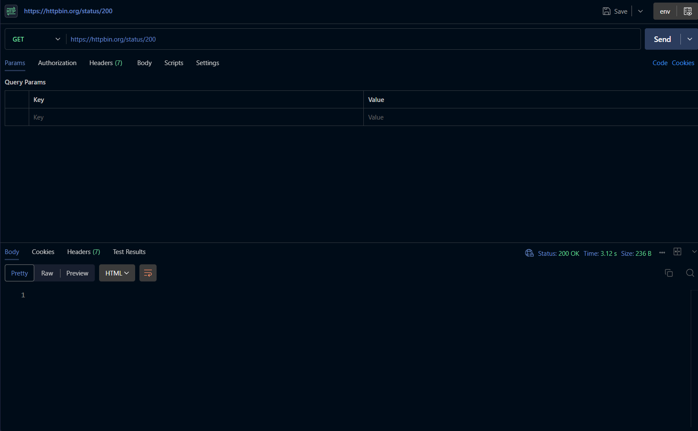
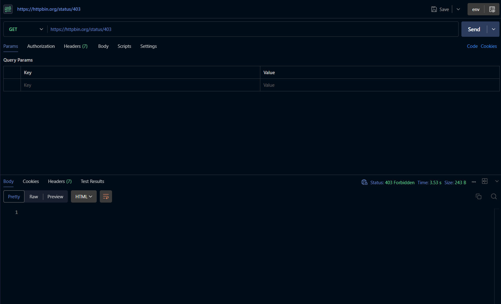

# Tugas Mandiri 2 — Memahami HTTP Status Code

## A. Tujuan

Tugas ini bertujuan untuk memahami fungsi dan arti dari HTTP status code yang diberikan oleh server. Pengujian dilakukan menggunakan layanan HTTPBin dengan endpoint `/status/:code` untuk menghasilkan status code tertentu.

Status code yang diuji adalah:

* 200
* 201
* 400
* 401
* 403
* 404
* 500

Pengujian dilakukan menggunakan Postman dengan metode `GET`.

---

## B. Metode Pengujian

Endpoint yang digunakan:

```text
https://httpbin.org/status/:code
```

Contoh pengujian:

```text
GET https://httpbin.org/status/200
```

Setiap nilai `:code` diganti dengan status code yang ingin diuji.

Pada pengujian ini, response body dari endpoint `/status/:code` kosong. Hal tersebut tidak menunjukkan bahwa request gagal, karena endpoint tersebut memang digunakan untuk menguji HTTP status code tertentu. Oleh karena itu, hasil utama yang diamati adalah status code yang diberikan oleh server.

---

## C. Hasil Pengujian

| Status Code | Arti                  | Hasil Pengujian                                             | Kapan Digunakan                                                                                      |
| ----------: | --------------------- | ----------------------------------------------------------- | ---------------------------------------------------------------------------------------------------- |
|         200 | OK                    | Server mengembalikan status `200` dan response body kosong. | Digunakan ketika request berhasil diproses oleh server.                                              |
|         201 | Created               | Server mengembalikan status `201` dan response body kosong. | Digunakan ketika request berhasil membuat resource atau data baru.                                   |
|         400 | Bad Request           | Server mengembalikan status `400` dan response body kosong. | Digunakan ketika request yang dikirim oleh client tidak valid atau tidak dapat diproses oleh server. |
|         401 | Unauthorized          | Server mengembalikan status `401` dan response body kosong. | Digunakan ketika request membutuhkan autentikasi atau kredensial yang diberikan tidak valid.         |
|         403 | Forbidden             | Server mengembalikan status `403` dan response body kosong. | Digunakan ketika client tidak memiliki izin untuk mengakses resource yang diminta.                   |
|         404 | Not Found             | Server mengembalikan status `404` dan response body kosong. | Digunakan ketika resource atau endpoint yang diminta tidak ditemukan.                                |
|         500 | Internal Server Error | Server mengembalikan status `500` dan response body kosong. | Digunakan ketika terjadi kesalahan yang tidak terduga pada sisi server.                              |

---

## D. Dokumentasi Pengujian

### 1. Pengujian Status Code 200

Request:

```text
GET https://httpbin.org/status/200
```

Hasil:

```text
200 OK
```

Response body kosong.

**Screenshot:**



---

### 2. Pengujian Status Code 201

Request:

```text
GET https://httpbin.org/status/201
```

Hasil:

```text
201 Created
```

Response body kosong.

**Screenshot:**

> Screenshot dapat ditambahkan jika diperlukan.

---

### 3. Pengujian Status Code 400

Request:

```text
GET https://httpbin.org/status/400
```

Hasil:

```text
400 Bad Request
```

Response body kosong.

**Screenshot:**

> Masukkan screenshot hasil pengujian status code `400` dari Postman di bagian ini.

---

### 4. Pengujian Status Code 401

Request:

```text
GET https://httpbin.org/status/401
```

Hasil:

```text
401 Unauthorized
```

Response body kosong.

---

### 5. Pengujian Status Code 403

Request:

```text
GET https://httpbin.org/status/403
```

Hasil:

```text
403 Forbidden
```

Response body kosong.

**Screenshot:**



---

### 6. Pengujian Status Code 404

Request:

```text
GET https://httpbin.org/status/404
```

Hasil:

```text
404 Not Found
```

Response body kosong.

**Screenshot:**

> Masukkan screenshot hasil pengujian status code `404` dari Postman di bagian ini.

---

### 7. Pengujian Status Code 500

Request:

```text
GET https://httpbin.org/status/500
```

Hasil:

```text
500 Internal Server Error
```

Response body kosong.

**Screenshot:**

> Masukkan screenshot hasil pengujian status code `500` dari Postman di bagian ini.

---

# E. Jawaban Pertanyaan

## 1. Apa perbedaan `400` dan `404`?

Status code `400 Bad Request` menunjukkan bahwa request yang dikirim oleh client tidak valid atau tidak dapat dipahami oleh server. Masalahnya berada pada isi atau struktur request yang dikirim.

Sedangkan `404 Not Found` menunjukkan bahwa server tidak menemukan resource atau endpoint yang diminta oleh client.

Contohnya, `400` dapat terjadi ketika client mengirim data dengan format yang tidak sesuai dengan aturan API. Sementara `404` dapat terjadi ketika client meminta URL atau resource yang tidak tersedia.

Jadi, perbedaannya adalah **400 berkaitan dengan request yang tidak valid, sedangkan 404 berkaitan dengan resource atau endpoint yang tidak ditemukan**.

---

## 2. Apa perbedaan `401` dan `403`?

Status code `401 Unauthorized` menunjukkan bahwa client belum memberikan autentikasi yang valid untuk mengakses resource. Misalnya, client belum login atau token autentikasi yang digunakan tidak valid.

Sedangkan `403 Forbidden` menunjukkan bahwa server memahami request dan client telah dikenali, tetapi client **tidak memiliki izin** untuk mengakses resource tersebut.

Contohnya:

* `401` → pengguna belum login atau token tidak valid.
* `403` → pengguna sudah login, tetapi tidak memiliki hak akses terhadap resource tertentu.

Jadi, **401 berkaitan dengan masalah autentikasi, sedangkan 403 berkaitan dengan masalah izin atau authorization**.

---

## 3. Mengapa `500` menunjukkan masalah pada sisi server?

Status code `500 Internal Server Error` menunjukkan bahwa server mengalami kesalahan ketika memproses request yang diterima.

Kesalahan tersebut dapat disebabkan oleh berbagai hal, misalnya:

* kesalahan pada program atau kode backend;
* kesalahan konfigurasi server;
* kegagalan koneksi ke database;
* exception yang tidak ditangani;
* masalah pada service yang digunakan oleh aplikasi.

Berbeda dengan status code `400` yang umumnya berkaitan dengan request dari client, status `500` menunjukkan bahwa server mengalami masalah ketika menjalankan proses yang diminta.

Namun, status `500` tidak selalu berarti perangkat server mengalami kerusakan secara fisik. Status tersebut lebih tepat dipahami sebagai **kesalahan internal yang terjadi ketika server memproses request**.

---

## 4. Apakah semua error HTTP berarti server mengalami kerusakan?

Tidak. Tidak semua HTTP error berarti server mengalami kerusakan.

HTTP status code digunakan untuk memberikan informasi mengenai hasil pemrosesan request. Beberapa error justru terjadi karena request dari client tidak sesuai atau client tidak memiliki akses.

Contohnya:

* `400 Bad Request` → request dari client tidak valid.
* `401 Unauthorized` → client membutuhkan autentikasi yang valid.
* `403 Forbidden` → client tidak memiliki izin.
* `404 Not Found` → resource yang diminta tidak ditemukan.
* `500 Internal Server Error` → terjadi kesalahan internal pada server.

Dengan demikian, **status code 4xx umumnya menunjukkan masalah pada request atau akses dari sisi client, sedangkan status code 5xx menunjukkan bahwa server mengalami masalah ketika memproses request**.

---

# F. Kesimpulan

Berdasarkan pengujian menggunakan HTTPBin, setiap HTTP status code memiliki arti dan fungsi yang berbeda. Status code `200` menunjukkan request berhasil, sedangkan `201` menunjukkan bahwa resource berhasil dibuat.

Status code `400`, `401`, `403`, dan `404` termasuk kategori error pada sisi client atau request, tetapi masing-masing memiliki penyebab yang berbeda. Sementara itu, status `500` menunjukkan adanya kesalahan internal ketika server memproses request.

Pengujian juga menunjukkan bahwa response body pada endpoint `/status/:code` dapat kosong. Hal tersebut merupakan kondisi yang normal karena tujuan endpoint tersebut adalah menghasilkan status code tertentu sehingga client dapat mengamati dan memahami arti dari masing-masing HTTP status code.

---

## G. Dokumentasi Screenshot

Minimal tiga screenshot hasil pengujian dilampirkan pada laporan:

1. Screenshot status `200 OK`
2. Screenshot status `404 Not Found`
3. Screenshot status `500 Internal Server Error`

Screenshot dapat ditempatkan pada bagian dokumentasi pengujian atau pada bagian ini.

### Lampiran


> Catatan: screenshot status `404` dan `500` belum tersedia. Saat ini baru tersedia `status_200.png` dan `status_403.png`.
