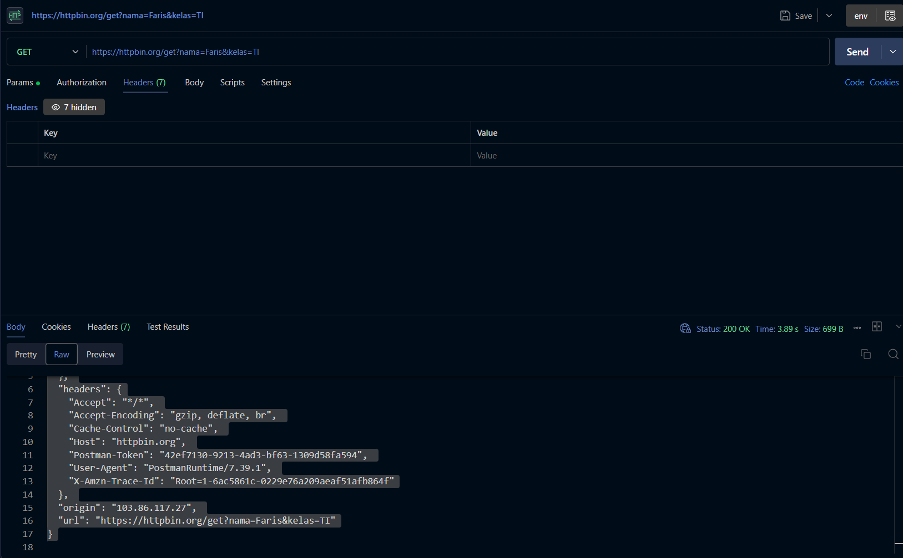
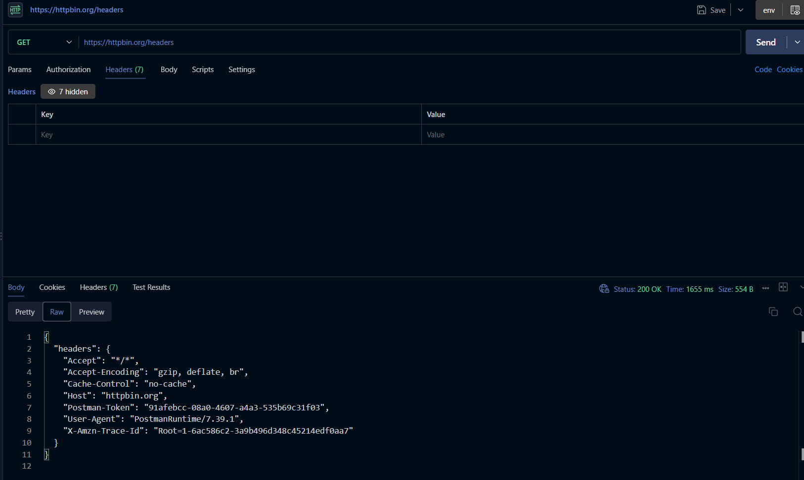

# Tugas Mandiri 3 — Memahami Request dan Response

## A. Tujuan

Tugas ini bertujuan untuk memahami konsep **request** dan **response** dalam komunikasi antara client dan server. Pengujian dilakukan menggunakan HTTPBin untuk melihat informasi yang benar-benar dikirim oleh client kepada server.

Pada tugas ini digunakan dua endpoint:

```text
GET https://httpbin.org/get?nama=Faris&kelas=TI
```

dan

```text
GET https://httpbin.org/headers
```

Endpoint `/get` digunakan untuk melihat informasi request beserta query parameter, sedangkan endpoint `/headers` digunakan untuk melihat HTTP header yang diterima oleh server.

---

## B. Konsep Request dan Response

Komunikasi antara client dan server dapat digambarkan sebagai berikut:

```text
Client
   |
   | Request
   ↓
Server
   |
   | Response
   ↓
Client
```

**Request** adalah permintaan yang dikirimkan oleh client kepada server. Request dapat berisi method HTTP, URL, query parameter, header, dan request body.

**Response** adalah hasil atau balasan yang diberikan oleh server setelah menerima dan memproses request dari client. Response dapat berisi status code, response header, dan response body.

---

# C. Pengujian Endpoint `/get`

## 1. Request

Request yang digunakan:

```text
GET https://httpbin.org/get?nama=Faris&kelas=TI
```

Query parameter yang dikirim:

| Parameter | Nilai   |
| --------- | ------- |
| `nama`    | `Faris` |
| `kelas`   | `TI`    |

---

## 2. Hasil Response

HTTPBin memberikan response sebagai berikut:

```json
{
  "args": {
    "kelas": "TI",
    "nama": "Faris"
  },
  "headers": {
    "Accept": "*/*",
    "Accept-Encoding": "gzip, deflate, br",
    "Cache-Control": "no-cache",
    "Host": "httpbin.org",
    "Postman-Token": "42ef7130-9213-4ad3-bf63-1309d58fa594",
    "User-Agent": "PostmanRuntime/7.39.1",
    "X-Amzn-Trace-Id": "Root=1-6ac5861c-0229e76a209aeaf51afb864f"
  },
  "origin": "103.86.117.27",
  "url": "https://httpbin.org/get?nama=Faris&kelas=TI"
}
```

Pada bagian `args`, server mengembalikan query parameter yang dikirim:

```json
{
  "kelas": "TI",
  "nama": "Faris"
}
```

Hal ini menunjukkan bahwa query parameter `nama=Faris` dan `kelas=TI` berhasil diterima oleh server.

Server juga mengembalikan informasi header, alamat origin, dan URL yang digunakan dalam request.

### Screenshot



---

# D. Pengujian Endpoint `/headers`

## 1. Request

Request yang digunakan:

```text
GET https://httpbin.org/headers
```

Endpoint ini digunakan untuk melihat HTTP header yang diterima oleh server.

---

## 2. Hasil Response

HTTPBin memberikan response sebagai berikut:

```json
{
  "headers": {
    "Accept": "*/*",
    "Accept-Encoding": "gzip, deflate, br",
    "Cache-Control": "no-cache",
    "Host": "httpbin.org",
    "Postman-Token": "91afebcc-08a0-4607-a4a3-535b69c31f03",
    "User-Agent": "PostmanRuntime/7.39.1",
    "X-Amzn-Trace-Id": "Root=1-6ac586c2-3a9b496d348c45214edf0aa7"
  }
}
```

Beberapa header yang diterima server antara lain:

| Header            | Nilai                   | Fungsi                                                                  |
| ----------------- | ----------------------- | ----------------------------------------------------------------------- |
| `Accept`          | `*/*`                   | Menunjukkan jenis response yang dapat diterima oleh client.             |
| `Accept-Encoding` | `gzip, deflate, br`     | Menunjukkan jenis kompresi yang dapat diterima oleh client.             |
| `Cache-Control`   | `no-cache`              | Memberikan instruksi terkait penggunaan cache.                          |
| `Host`            | `httpbin.org`           | Menunjukkan server tujuan dari request.                                 |
| `User-Agent`      | `PostmanRuntime/7.39.1` | Menunjukkan aplikasi atau client yang digunakan untuk mengirim request. |
| `X-Amzn-Trace-Id` | `Root=...`              | Digunakan untuk membantu pelacakan request.                             |

### Screenshot



---

# E. Jawaban Pertanyaan

## 1. Apa yang dimaksud request?

Request adalah permintaan yang dikirimkan oleh client kepada server untuk melakukan suatu tindakan atau mendapatkan suatu informasi.

Request dapat berisi beberapa komponen, seperti:

* HTTP method, misalnya `GET`, `POST`, `PUT`, atau `DELETE`;
* URL atau endpoint yang dituju;
* query parameter;
* HTTP header;
* request body, jika diperlukan.

Pada pengujian ini, contoh request yang digunakan adalah:

```text
GET https://httpbin.org/get?nama=Faris&kelas=TI
```

Request tersebut menggunakan method `GET` dan mengirimkan query parameter `nama` serta `kelas`.

---

## 2. Apa yang dimaksud response?

Response adalah balasan yang diberikan oleh server setelah menerima dan memproses request dari client.

Response dapat berisi:

* HTTP status code;
* response header;
* response body.

Pada pengujian endpoint `/get`, server memberikan response berupa data JSON yang berisi query parameter, header, origin, dan URL yang diterima.

Dengan demikian, response digunakan oleh client untuk mengetahui hasil dari request yang telah dikirimkan.

---

## 3. Apa fungsi query parameter?

Query parameter digunakan untuk mengirimkan data atau parameter tambahan melalui URL kepada server.

Query parameter biasanya ditulis setelah tanda `?`.

Contohnya:

```text
https://httpbin.org/get?nama=Faris&kelas=TI
```

Pada URL tersebut terdapat dua query parameter:

```text
nama=Faris
kelas=TI
```

HTTPBin kemudian menampilkan kembali data tersebut pada bagian `args`:

```json
"args": {
  "kelas": "TI",
  "nama": "Faris"
}
```

Query parameter biasanya digunakan untuk kebutuhan seperti pencarian, filtering, sorting, pagination, atau memberikan parameter tertentu kepada server.

---

## 4. Apa fungsi HTTP header?

HTTP header digunakan untuk membawa informasi tambahan mengenai request atau response.

Pada request, header dapat memberikan informasi kepada server mengenai client dan bagaimana request tersebut harus diproses.

Contohnya pada hasil pengujian terdapat:

```text
User-Agent: PostmanRuntime/7.39.1
```

Header tersebut menunjukkan bahwa request dikirim menggunakan Postman.

Contoh lainnya:

```text
Accept: */*
```

Header tersebut menunjukkan bahwa client dapat menerima berbagai jenis format response.

Dengan demikian, HTTP header berfungsi sebagai informasi tambahan yang membantu client dan server berkomunikasi dengan lebih baik.

---

## 5. Apa perbedaan data pada URL dengan data pada request body?

Data pada URL biasanya dikirim menggunakan **query parameter** dan dapat terlihat langsung pada URL.

Contohnya:

```text
GET https://httpbin.org/get?nama=Faris&kelas=TI
```

Data `nama=Faris` dan `kelas=TI` merupakan data yang dikirim melalui URL.

Sedangkan request body merupakan data yang dikirim di bagian body dari HTTP request. Request body lebih umum digunakan pada method seperti `POST`, `PUT`, dan `PATCH`.

Contohnya:

```json
{
  "nama": "Faris",
  "kelas": "TI"
}
```

Perbedaannya dapat diringkas sebagai berikut:

| Data pada URL                                            | Request Body                                                          |
| -------------------------------------------------------- | --------------------------------------------------------------------- |
| Berada pada URL sebagai query parameter                  | Berada pada bagian body request                                       |
| Mudah terlihat pada URL                                  | Tidak ditampilkan pada URL                                            |
| Sering digunakan untuk filter, pencarian, atau parameter | Sering digunakan untuk mengirim data yang akan diproses atau disimpan |
| Contoh: `?nama=Faris`                                    | Contoh: `{ "nama": "Faris" }`                                         |

Penggunaan keduanya bergantung pada kebutuhan aplikasi dan method HTTP yang digunakan.

---

# F. Kesimpulan

Berdasarkan pengujian menggunakan HTTPBin, request merupakan permintaan yang dikirim oleh client kepada server, sedangkan response merupakan balasan yang diberikan oleh server.

Pada endpoint `/get`, query parameter `nama=Faris` dan `kelas=TI` berhasil diterima server dan ditampilkan kembali pada bagian `args`. Hal tersebut menunjukkan bahwa data yang dikirim melalui URL dapat diterima dan diproses oleh server.

Pada endpoint `/headers`, HTTPBin menampilkan berbagai header yang diterima dari client, seperti `Accept`, `Accept-Encoding`, `Host`, dan `User-Agent`.

Dari pengujian tersebut dapat dipahami bahwa request dan response memiliki beberapa bagian penting, seperti method, URL, query parameter, header, status code, dan body. Pemahaman terhadap komponen tersebut merupakan dasar penting dalam pengembangan aplikasi yang menggunakan komunikasi HTTP dan API.
