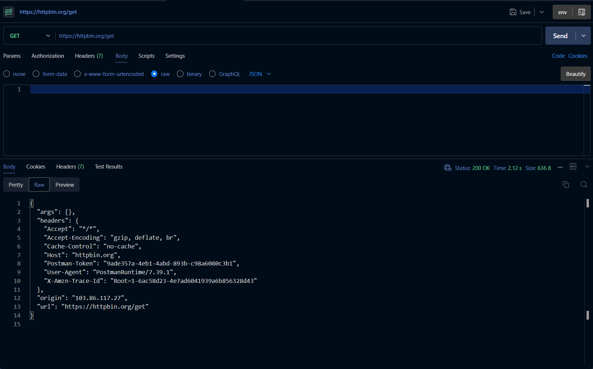
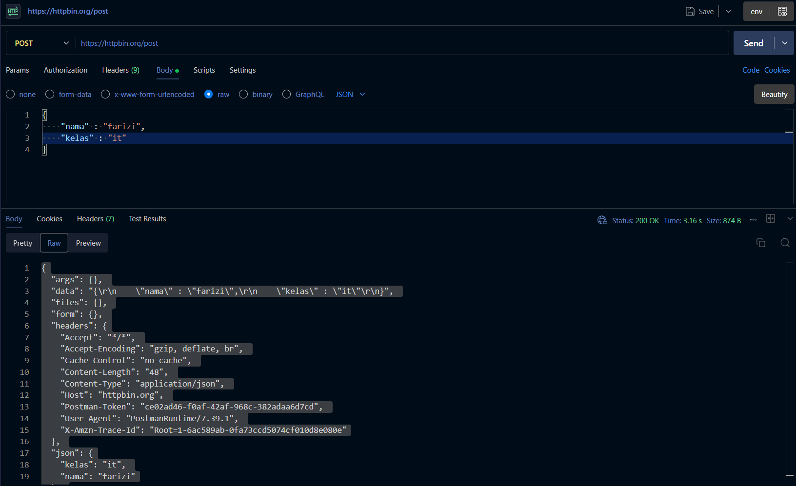
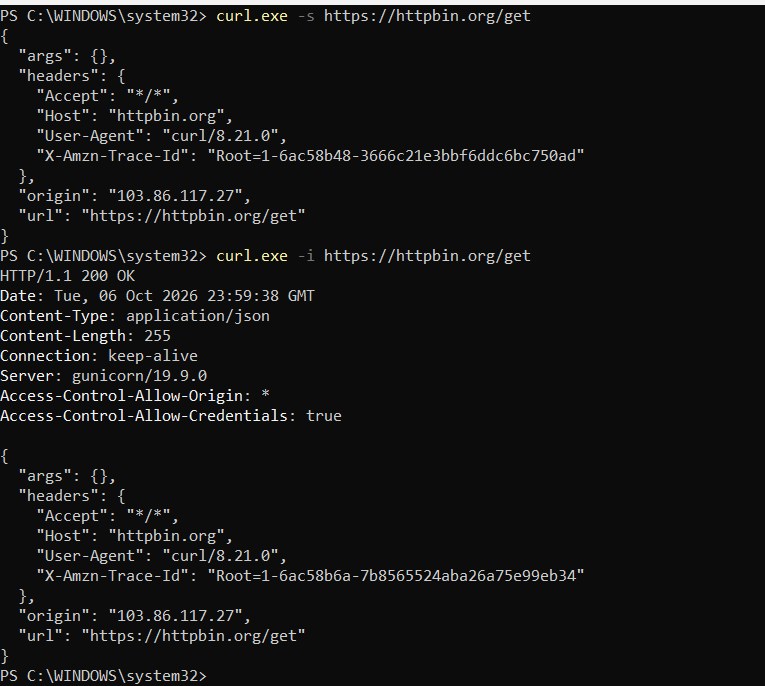

# Tugas Mandiri 4 — Pengujian API dengan Postman dan curl

## A. Tujuan

Tugas ini bertujuan untuk melakukan pengujian API menggunakan dua alat, yaitu **Postman** dan **curl**. Pengujian dilakukan untuk memahami cara mengirim request, melihat response, HTTP status code, response header, dan response body.

Endpoint yang digunakan adalah HTTPBin:

```text
https://httpbin.org
```

---

# B. Pengujian Menggunakan Postman

## 1. GET `/get`

Request yang digunakan:

```text
GET https://httpbin.org/get
```

Hasil response:

```json
{
  "args": {},
  "headers": {
    "Accept": "*/*",
    "Accept-Encoding": "gzip, deflate, br",
    "Cache-Control": "no-cache",
    "Host": "httpbin.org",
    "Postman-Token": "53c649bc-1ace-4024-a59f-900d4e0b1b2c",
    "User-Agent": "PostmanRuntime/7.39.1",
    "X-Amzn-Trace-Id": "Root=1-6ac588e7-5f13b5730d52b78638c25ddb"
  },
  "origin": "103.86.117.27",
  "url": "https://httpbin.org/get"
}
```

Pada response tersebut, bagian `args` kosong karena request GET tidak menggunakan query parameter.

Server juga mengembalikan informasi header, alamat origin, dan URL yang digunakan.

### Screenshot



---

## 2. POST `/post`

Request yang digunakan:

```text
POST https://httpbin.org/post
```

Data JSON yang dikirim:

```json
{
  "nama": "farizi",
  "kelas": "it"
}
```

Hasil response:

```json
{
  "args": {},
  "data": "{\r\n    \"nama\" : \"farizi\",\r\n    \"kelas\" : \"it\"\r\n}",
  "files": {},
  "form": {},
  "headers": {
    "Accept": "*/*",
    "Accept-Encoding": "gzip, deflate, br",
    "Cache-Control": "no-cache",
    "Content-Length": "48",
    "Content-Type": "application/json",
    "Host": "httpbin.org",
    "Postman-Token": "ce02ad46-f0af-42af-968c-382adaa6d7cd",
    "User-Agent": "PostmanRuntime/7.39.1",
    "X-Amzn-Trace-Id": "Root=1-6ac589ab-0fa73ccd5074cf010d8e080e"
  },
  "json": {
    "kelas": "it",
    "nama": "farizi"
  },
  "origin": "103.86.117.27",
  "url": "https://httpbin.org/post"
}
```

Pada response terdapat bagian `json` yang menunjukkan bahwa server berhasil menerima dan membaca data JSON yang dikirim.

Selain itu, header:

```text
Content-Type: application/json
```

menunjukkan bahwa data yang dikirim memiliki format JSON.

### Screenshot



---

# C. Perbandingan Response GET dan POST

| Aspek          | GET                      | POST                      |
| -------------- | ------------------------ | ------------------------- |
| Endpoint       | `/get`                   | `/post`                   |
| Data pada body | Tidak ada                | Ada                       |
| Format data    | Tidak menggunakan body   | JSON                      |
| `args`         | Kosong                   | Kosong                    |
| `json`         | Tidak tersedia           | Berisi `nama` dan `kelas` |
| `Content-Type` | Tidak dikirim            | `application/json`        |
| Fungsi utama   | Mengambil data/informasi | Mengirim data ke server   |

Berdasarkan pengujian, GET digunakan untuk mengambil informasi dari endpoint `/get`, sedangkan POST digunakan untuk mengirim data JSON kepada endpoint `/post`.

---

# D. Pengujian Menggunakan curl

## 1. curl `-i` pada `/get`

Perintah yang digunakan:

```powershell
curl.exe -i https://httpbin.org/get
```

Hasil response:

```text
HTTP/1.1 200 OK
Date: Tue, 06 Oct 2026 23:58:34 GMT
Content-Type: application/json
Content-Length: 255
Connection: keep-alive
Server: gunicorn/19.9.0
Access-Control-Allow-Origin: *
Access-Control-Allow-Credentials: true
```

Response body:

```json
{
  "args": {},
  "headers": {
    "Accept": "*/*",
    "Host": "httpbin.org",
    "User-Agent": "curl/8.21.0",
    "X-Amzn-Trace-Id": "Root=1-6ac58b09-23f729a13e15c16a685cefec"
  },
  "origin": "103.86.117.27",
  "url": "https://httpbin.org/get"
}
```

Perintah `-i` menampilkan response header sekaligus response body.

### Screenshot



---

## 2. curl `-i` pada Status 404

Perintah yang digunakan:

```powershell
curl.exe -i https://httpbin.org/status/404
```

Hasil:

```text
HTTP/1.1 404 NOT FOUND
Date: Tue, 06 Oct 2026 23:58:34 GMT
Content-Type: text/html; charset=utf-8
Content-Length: 0
Connection: keep-alive
Server: gunicorn/19.9.0
Access-Control-Allow-Origin: *
Access-Control-Allow-Credentials: true
```

Status `404 NOT FOUND` menunjukkan bahwa server mengembalikan status code 404 sesuai dengan endpoint yang diminta.

Pada hasil pengujian terdapat:

```text
Content-Length: 0
```

Hal tersebut menunjukkan bahwa response body tidak memiliki isi.

---

# E. Perbandingan `curl -s` dan `curl -i`

## 1. Pengujian `curl -s`

Perintah:

```powershell
curl.exe -s https://httpbin.org/get
```

Hasil:

```json
{
  "args": {},
  "headers": {
    "Accept": "*/*",
    "Host": "httpbin.org",
    "User-Agent": "curl/8.21.0",
    "X-Amzn-Trace-Id": "Root=1-6ac58b48-3666c21e3bbf6ddc6bc750ad"
  },
  "origin": "103.86.117.27",
  "url": "https://httpbin.org/get"
}
```

Pada hasil tersebut, yang terlihat adalah response body tanpa response header.

---

## 2. Pengujian `curl -i`

Perintah:

```powershell
curl.exe -i https://httpbin.org/get
```

Hasil:

```text
HTTP/1.1 200 OK
Date: Tue, 06 Oct 2026 23:59:38 GMT
Content-Type: application/json
Content-Length: 255
Connection: keep-alive
Server: gunicorn/19.9.0
Access-Control-Allow-Origin: *
Access-Control-Allow-Credentials: true
```

Kemudian diikuti oleh response body:

```json
{
  "args": {},
  "headers": {
    "Accept": "*/*",
    "Host": "httpbin.org",
    "User-Agent": "curl/8.21.0",
    "X-Amzn-Trace-Id": "Root=1-6ac58b6a-7b8565524aba26a75e99eb34"
  },
  "origin": "103.86.117.27",
  "url": "https://httpbin.org/get"
}
```

### Screenshot


---

# F. Penjelasan `curl -s` dan `curl -i`

Opsi `-s` atau **silent mode** digunakan untuk menyembunyikan progress meter dan output terkait proses transfer sehingga hasil response lebih bersih. Pada pengujian ini, response body JSON dapat terlihat tanpa informasi response header. Sementara itu, opsi `-i` digunakan untuk menampilkan response header sebelum response body, sehingga informasi seperti HTTP status code, `Content-Type`, dan `Content-Length` dapat dilihat. Opsi `-s` cocok digunakan ketika hanya membutuhkan hasil response secara ringkas, sedangkan `-i` cocok digunakan ketika ingin memeriksa informasi header dan status HTTP.

---

# G. Kesimpulan

Berdasarkan pengujian menggunakan Postman dan curl, kedua alat dapat digunakan untuk melakukan pengujian API dan melihat response dari server.

Pada pengujian menggunakan Postman, request GET tidak mengirimkan request body, sedangkan request POST mengirimkan data JSON berupa `nama` dan `kelas`. HTTPBin berhasil menerima data tersebut dan menampilkannya kembali pada bagian `json`.

Pada pengujian menggunakan curl, opsi `-i` dapat digunakan untuk melihat response header dan response body secara bersamaan. Sementara itu, opsi `-s` membuat output menjadi lebih sederhana dengan menyembunyikan progress meter.

Dengan menggunakan Postman dan curl, proses pengujian API dapat dilakukan dengan lebih mudah untuk mengetahui HTTP status code, header, body, serta informasi lain yang dikirim oleh server.
